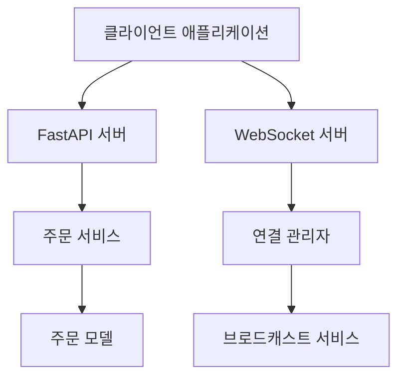

# 주문 관리 시스템

FastAPI로 구축된 실시간 주문 관리 시스템으로, 실시간 주문 업데이트를 위한 WebSocket 연결과 강력한 주문 추적 기능을 제공합니다.

## 빠른 시작

### 설치

1. 저장소 복제:
```bash
git clone https://github.com/din0497/react-fastapi-backend.git
```

2. 가상 환경 생성 및 활성화:
```bash
python -m venv venv
source venv/bin/activate  # Windows의 경우: venv\Scripts\activate
```

3. 의존성 설치:
```bash
pip install -r requirements.txt
```

### 애플리케이션 실행

1. 서버 시작:
```bash
uvicorn app.main:app --reload
```

## API 사용법

### REST 엔드포인트

1. 주문 생성:
```bash
POST /order
{
    "foodName": "피자",
    "quantity": 2
}
```

2. 모든 주문 조회:
```bash
GET /orders
```

3. 주문 상태 업데이트:
```bash
PUT /order/{order_id}/status
{
    "status": "preparing"
}
```

### WebSocket 연결

```javascript
const ws = new WebSocket('ws://localhost:8000/ws');
ws.onmessage = (event) => {
    const data = JSON.parse(event.data);
    console.log('수신됨:', data);
};
```

## 시스템 아키텍처

### 상위 수준 설계



### 주요 구성 요소

1. **FastAPI 서버**
   - REST API 엔드포인트
   - WebSocket 지원
   - 의존성 주입
   - 오류 처리

2. **주문 서비스**
   - 주문 수명 주기 관리
   - 동시 작업
   - 비즈니스 로직
   - 데이터 일관성

3. **연결 관리자**
   - WebSocket 연결 처리
   - 실시간 브로드캐스트
   - 연결 풀링
   - 정상적인 연결 해제 처리

### 데이터 모델

```python
class Order:
    id: str
    foodName: str
    quantity: int
    status: OrderStatus
    timestamp: datetime
```

## 프로젝트 구조

```
app/
├── api/
│   ├── routes/
│   │   └── orders.py      # API 엔드포인트
│   └── websocket/
│       └── manager.py     # WebSocket 연결 관리
├── models/
│   └── order.py          # 주문 데이터 모델
├── services/
│   └── order_service.py  # 비즈니스 로직
├── config.py             # 구성 설정
├── exceptions.py         # 사용자 정의 예외
└── main.py              # 애플리케이션 진입점
```

## 테스트

테스트 스위트 실행:
```bash
pytest
```

테스트 커버리지 확인:
```bash
pytest --cov=app --cov-report=term-missing
```

## 보안 구현

- CORS 미들웨어 활성화
- Pydantic을 사용한 입력 유효성 검사
- 포괄적인 오류 처리
- 로깅 시스템
- 속도 제한 (계획됨)
- 인증 (계획됨)

## 확장성 기능

### 현재 구현
- 동시 요청을 위한 비동기 작업
- WebSocket용 연결 풀링
- 효율적인 브로드캐스트 메커니즘
- 메모리 효율적인 데이터 구조
